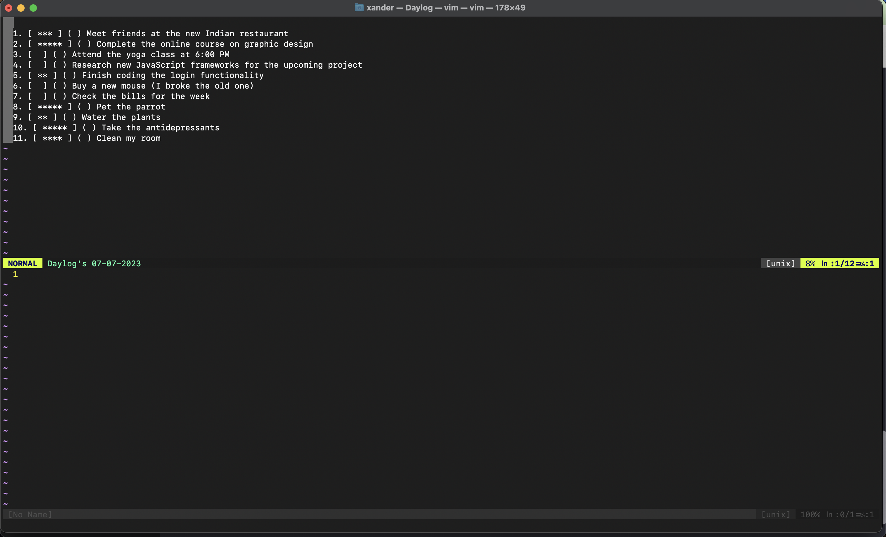

## Introduction

Introducing Daylog.vim: A Powerful To-Do List Plugin for VIM

Daylog.vim is a versatile and efficient Vim plugin designed to enhance your productivity by providing a comprehensive to-do list functionality right within your Vim editor. With daylog.vim, you can easily manage and organize your tasks, prioritize entries, and maintain a structured workflow without ever leaving the comfort of your coding environment. 🪴


## Features

1. Create and Manage DayLogs:

- Effortlessly create new DayLogs with a single command, automatically adding a new entry for the current day if it already exists.
- Set specific dates for DayLogs to create entries for any desired date.

2. View and Filter DayLog Entries:

- Seamlessly view DayLog entries based on different modes, such as displaying all entries, completed entries, or pending tasks for the current day.
- Use the "ViewAll" command to quickly access all entries for the present day.

3. Task Manipulation:

- Toggle the completion status of DayLog tasks using the "ToggleDaylog" command.
- Delete specific tasks from the DayLog using the "DeleteDaylog" command.
- Prioritize entries with the "Prioritize" command, assigning priority levels to effectively manage your workload.
- Reorder entries within the DayLog using the "Order" command.

4. DayLog Management:

- Wipe out the entire list of entries for a particular DayLog by using the "WipeDaylog" command, specifying the date.
- Set the current DayLog's date to a specific date with the "SetDaylog" command, or easily switch to today's date using "SetToday".
- Access a comprehensive list of all DayLogs with the "DaylogsView" command.

## Installation

Use your favorite plugin manager to install this plugin. tpope/vim-pathogen, VundleVim/Vundle.vim, junegunn/vim-plug, and Shougo/dein.vim are some of the more popular ones. A lengthy discussion of these and other managers can be found on vi.stackexchange.com. Basic instructions are provided below, but please be sure to read, understand, and follow all the safety rules that come with your plugin manager.

## Usage/Examples

Creating a new entry in selected (by default is today's) Daylog

```bash
:NewDaylog
```

View the entries in the selected DayLog

```bash
:View [mode]
```

Modes are:

- all - shows all the entries for today
- done - shows all done entries for today
- not_done - shows all entries that have not been completed for today

View all entries in the selected Daylog

```bash
:ViewAll
```

Toggle the tasks of the DayLog

```bash
:ToggleDaylog [index of the entry]
```

Delete a task of the Daylog

```bash
:DeleteDaylog [index of the entry]
```

Wipe a DayLog

```bash
:WipeDaylog [date of daylog]
```

Set a Daylog

```bash
:SetDaylog [date of a log]
```

*(if Daylog with this date doesn't exist, it creates a Daylog for it)*

```bash
:SetToday
```

Show a list of all DayLogs

```bash
:DaylogsView
```

Prioritize entries

```bash
:Prioritize [index] [priority]
```

Order entries by priority (high to low)

```bash
:Order
```
